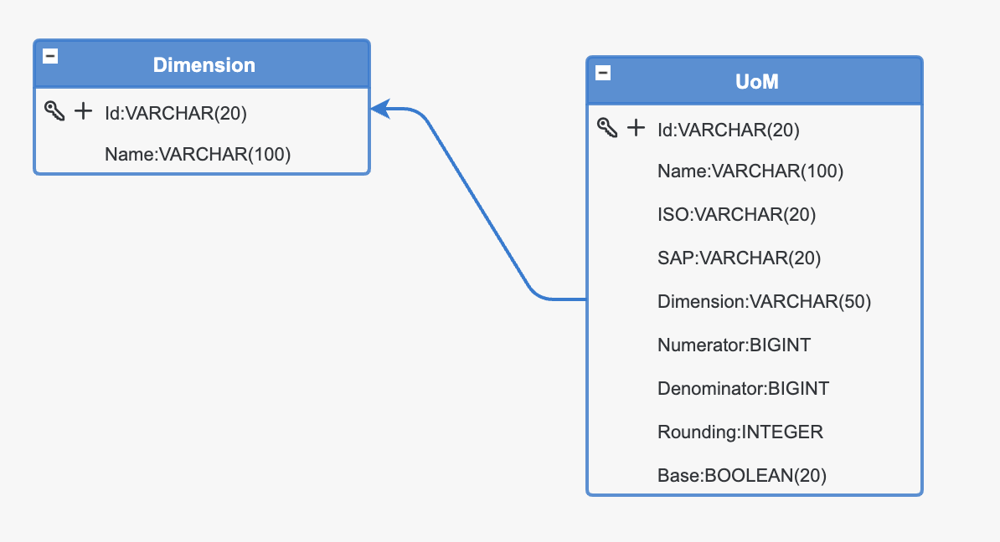
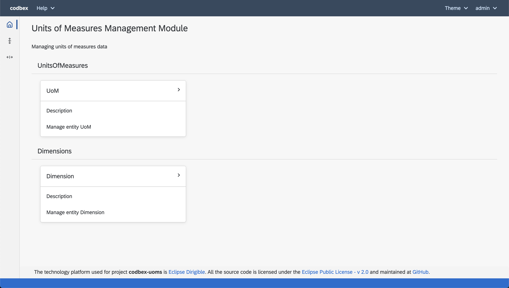
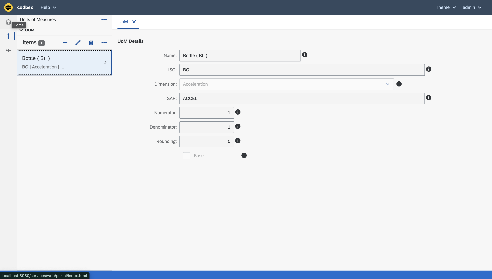
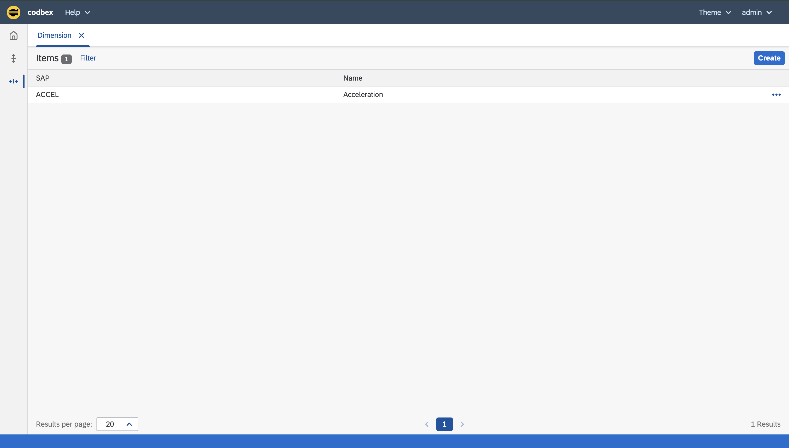

# codbex-uoms
UoMs Management Module

- Data module: [codbex-uoms-data](https://github.com/codbex/codbex-uoms-data)

### Model

### Application

#### Launchpad

#### Management

#### Converter

	http://host:port/services/ts/codbex-uoms/api/ConverterController.ts/<UOM_ISO>/<UOM_ISO>/50

	http://host:port/services/ts/codbex-uoms/api/ConverterController.ts/CMT/DMT/50
	
