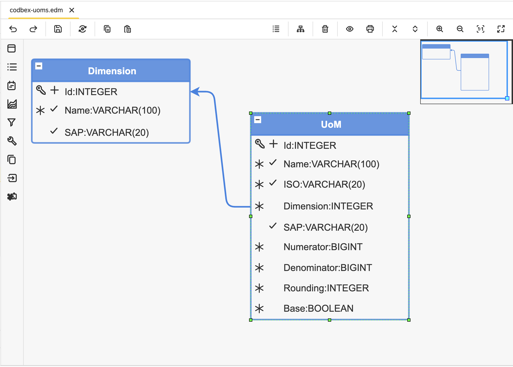

#  codbex-uoms

## 📖 Table of Contents
* [🗺️ Entity Data Model (EDM)](#️-entity-data-model-edm)
* [🧩 Core Entities](#-core-entities)
* [🔗 Sample Data Modules](#-sample-data-modules)
* [🐳 Local Development with Docker](#-local-development-with-docker)

## 🗺️ Entity Data Model (EDM)



## 🧩 Core Entities

### Entity: `UoM`

| Field       | Type     | Details                       | Description                              |
|-------------| -------- |-------------------------------| ---------------------------------------- |
| Id          | INTEGER  | PK, Identity       | Unique identifier for the unit of measure. |
| Name        | VARCHAR  | Length: 100, Unique, Not Null | Name of the unit of measure.             |
| ISO         | VARCHAR  | Length: 20, Unique, Not Null  | ISO code for the unit of measure.        |
| Dimension   | INTEGER  | FK, Not Null                  | Foreign key referencing the dimension.   |
| SAP         | VARCHAR  | Length: 20, Nullable, Unique  | SAP code for the unit of measure.        |
| Numerator   | BIGINT   | Not Null                      | Numerator for unit conversion.           |
| Denominator | BIGINT   | Not Null                      | Denominator for unit conversion.         |
| Rounding    | INTEGER  | Default: 0, Not Null          | Rounding value for the unit of measure.  |
| Base        | BOOLEAN  | Default: false, Not Null              | Indicates if this is the base unit.      |

### Entity: `Dimension`

| Field | Type     | Details                       | Description                              |
|-------| -------- |-------------------------------| ---------------------------------------- |
| Id    | INTEGER  | PK, Identity       | Unique identifier for the dimension.     |
| Name  | VARCHAR  | Length: 100, Unique, Not Null | Name of the dimension.                   |
| SAP   | VARCHAR  | Length: 20, Nullable, Unique  | SAP code for the dimension.              |

## 🔗 Sample Data Modules

- [codbex-uoms-data](https://github.com/codbex/codbex-uoms-data)

## 🐳 Local Development with Docker

When running this project inside the codbex Atlas Docker image, you must provide authentication for installing dependencies from GitHub Packages.
1. Create a GitHub Personal Access Token (PAT) with `read:packages` scope.
2. Pass `NPM_TOKEN` to the Docker container:

    ```
    docker run \
    -e NPM_TOKEN=<your_github_token> \
    --rm -p 80:80 \
    ghcr.io/codbex/codbex-atlas:latest
    ```

⚠️ **Notes**
- The `NPM_TOKEN` must be available at container runtime.
- This is required even for public packages hosted on GitHub Packages.
- Never bake the token into the Docker image or commit it to source control.
