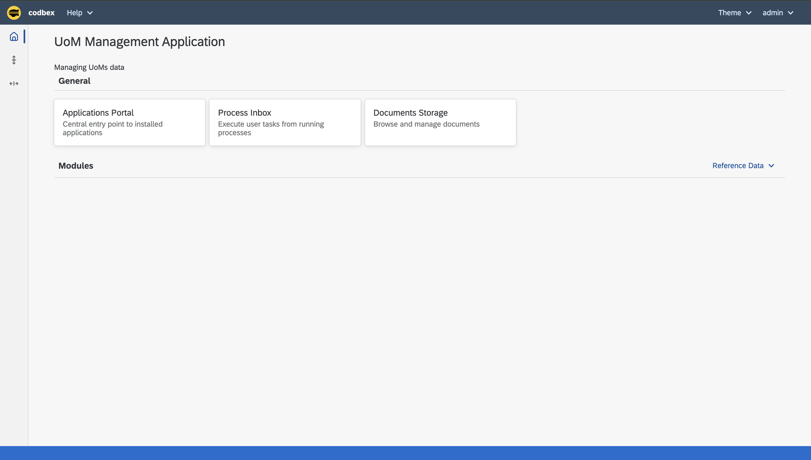

# codbex-uoms
UoMs Management Application

### Model

### Application

#### Launchpad

#### Management

#### Converter

	http://host:port/services/ts/codbex-uoms/api/converter.ts/CMT/DMT/50

### Infrastructure

#### Build

	docker build -t codbex-uoms:1.0.0 .

#### Run

	docker run --name codbex-uoms -d -p 8080:8080 codbex-uoms:1.0.0

#### Clean

	docker rm codbex-uoms
